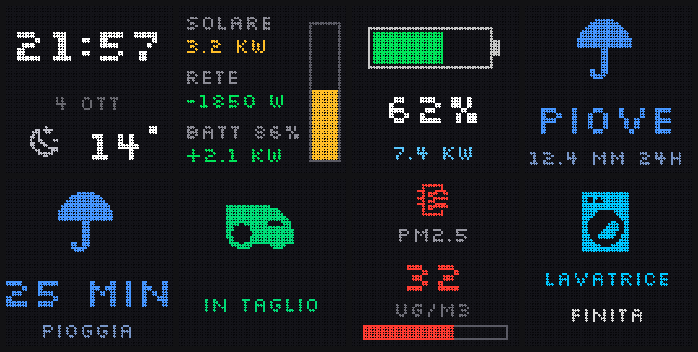
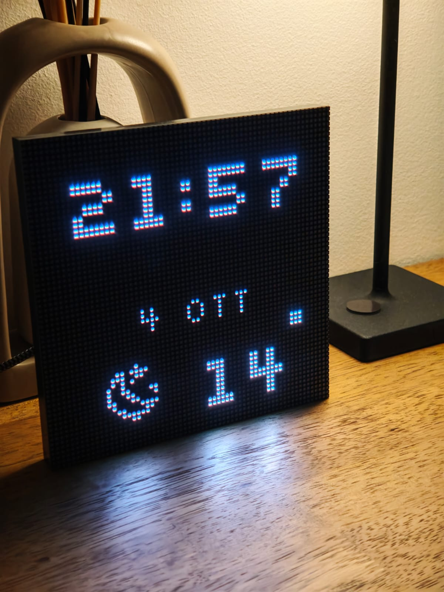
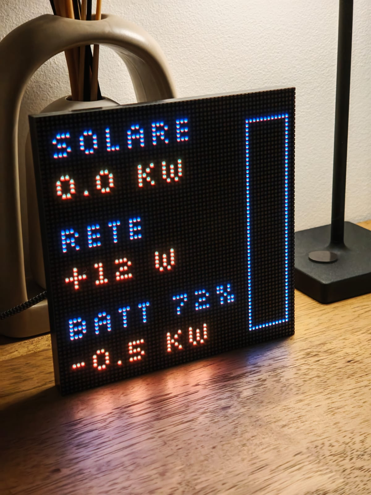
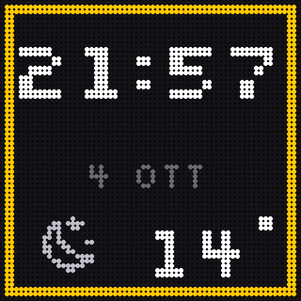
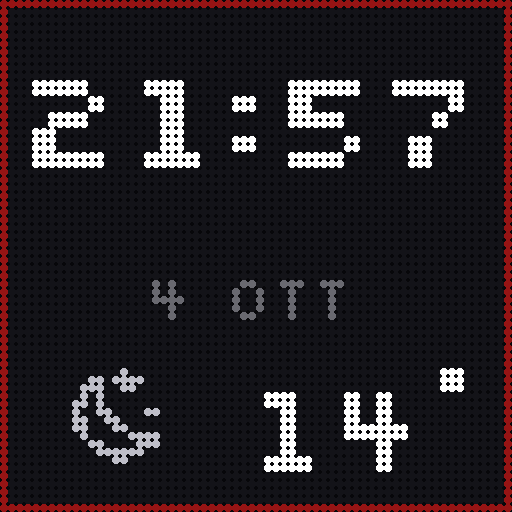
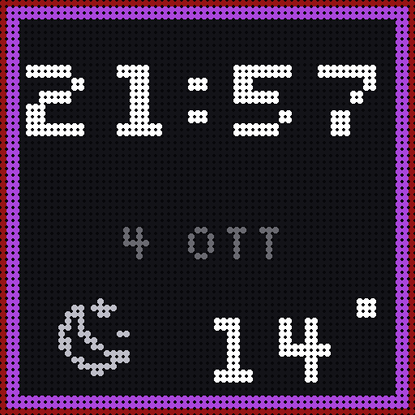

# Apollo M-1 · display informativo per Home Assistant

Configurazione ESPHome che trasforma un **Apollo Automation M-1** (matrice LED HUB75 64×64 su ESP32-S3) in un pannello informativo per Home Assistant: orologio, meteo, flusso energetico di casa, ricarica dell'auto elettrica, pioggia, rasaerba, qualità dell'aria, stato dell'allarme e notifiche puntuali.



<p align="center">
  
  
</p>

I dati continui vengono letti direttamente da ESPHome tramite la piattaforma `homeassistant`. Gli eventi puntuali (lavatrice finita, campanello, porta aperta) arrivano da **Node-RED** attraverso un'azione API esposta dal device. Questa divisione è voluta: i dati sopravvivono a un riavvio di Node-RED, e la logica degli eventi resta dove è comoda da modificare.

---

## Indice

- [Cosa mostra](#cosa-mostra)
- [Requisiti](#requisiti)
- [Installazione](#installazione)
- [Entità richieste](#entità-richieste)
- [Parametri configurabili](#parametri-configurabili)
- [Controlli esposti in Home Assistant](#controlli-esposti-in-home-assistant)
- [Azioni API](#azioni-api)
- [Node-RED](#node-red)
- [Come aggiungere una pagina](#come-aggiungere-una-pagina)
- [Vincoli grafici](#vincoli-grafici-64x64)
- [Diagnostica](#diagnostica)
- [Problemi noti](#problemi-noti)
- [Licenza](#licenza)

---

## Cosa mostra

Le pagine ruotano ogni 7 secondi, con la **home reinserita fra una pagina e l'altra**, così resta quella dominante. Una pagina entra in rotazione solo quando ha qualcosa da dire.

| Pagina | Contenuto | Quando compare |
|---|---|---|
| **Home** | ora, data, icona meteo, temperatura esterna | sempre |
| **Energia** | produzione solare, flusso di rete, carica e potenza dell'accumulo, barra di produzione | produzione > 150 W, oppure rete o batteria oltre 300 W |
| **Auto** | batteria disegnata, percentuale, kW di ricarica | wallbox sopra la soglia di ricarica |
| **Pioggia** | `PIOVE` + mm nelle 24h, oppure minuti al prossimo rovescio | pluviometro attivo, o nowcast entro 60 minuti |
| **Rasaerba** | icona e stato | robot non in stato di riposo |
| **Aria** | PM2.5 con soglie colorate e barra | sopra la soglia di attenzione |
| **Allarme** | schermata rossa lampeggiante | allarme `triggered`, ha la precedenza su tutto |
| **Alert** | icona, due righe di testo, colore e durata configurabili | su chiamata dell'azione API |

<p align="center">
  
  
  
  
</p>

**Cornici di stato**, disegnate su ogni pagina:

- bordo esterno **rosso** se l'allarme è inserito, **ambra** durante l'inserimento
- riquadro interno di 2 px **giallo / blu / viola** quando domani passa il ritiro di carta, plastica o secco, visibile dalle 17 in poi

---

## Requisiti

- **ESPHome ≥ 2025.12** — il componente display `hub75` è ufficiale da questa versione e include i preset pin `apollo-automation-m1-rev4` e `apollo-automation-m1-rev6`
- Home Assistant con l'integrazione ESPHome
- Node-RED con `node-red-contrib-home-assistant-websocket` (solo per gli alert)
- Il builder deve raggiungere internet in compilazione: scarica i font da Google Fonts e da GitHub

---

## Installazione

### 1. Secrets

Nel file **Secrets** del builder ESPHome:

```yaml
wifi_ssid: "LaTuaRete"
wifi_password: "..."
m1_api_key: "chiave base64 di 32 byte"
m1_ota_password: "..."
```

La chiave API si genera con `openssl rand -base64 32`.

### 2. Revisione della scheda

In cima a `m1-matrix.yaml`, imposta la substitution `m1_board` su `apollo-automation-m1-rev4` oppure `apollo-automation-m1-rev6` secondo la serigrafia del controller.

### 3. Primo flash via USB

Dal firmware di fabbrica (WLED) non si può passare in OTA. Scarica il **factory bin** dal builder, poi da PC:

```bash
pip install esptool
py -m esptool --chip esp32s3 --port COM5 erase_flash
py -m esptool --chip esp32s3 --port COM5 --baud 921600 write_flash 0x0 m1-matrix.factory.bin
```

In alternativa **web.esphome.io** da Chrome o Edge. Se il chip non entra in download mode da solo, stacca il cavo, tieni premuto il pulsante, ricollega e rilancia.

> **Backup del firmware precedente**, prima di cancellare: `read_flash 0 0x1000000 backup.bin` produce un'immagine completa da 16 MB ripristinabile con `write_flash 0x0 backup.bin`. Se usavi WLED, scarica anche `cfg.json` e `presets.json` dalla sua pagina *Security & Updates*.

### 4. Adozione in Home Assistant

Il device compare in *Impostazioni → Dispositivi e servizi*. Confermi, incolli la chiave di cifratura. **Va fatto prima di usare i sensori**: senza connessione API tutte le entità `platform: homeassistant` restano senza stato e vedi solo l'orologio con la scritta `sync`.

Da qui in poi gli aggiornamenti sono OTA.

### 5. Sensore nowcast pioggia (opzionale)

La pagina pioggia usa un sensore che non esiste di serie. Con una API key gratuita di [Tomorrow.io](https://www.tomorrow.io/), in `configuration.yaml`:

```yaml
rest:
  - resource: "https://api.tomorrow.io/v4/weather/forecast?location=LAT,LON&timesteps=1m&units=metric&apikey=CHIAVE"
    scan_interval: 600
    timeout: 30
    headers:
      Accept: application/json
    sensor:
      - name: "Minuti alla pioggia nowcast"
        unique_id: minuti_alla_pioggia_rest
        unit_of_measurement: "min"
        value_template: >-
          
          
            
              
            
          
          {{ ns.m }}
```

Restituisce i minuti al primo minuto con pioggia, oppure `-1`. Senza questo sensore la pagina semplicemente non entra mai in rotazione, senza errori.

> **Nota Jinja**: le parentesi quadre su `['values']` non sono stilistiche. `values` è un metodo dei dizionari, quindi `f.values` restituisce la funzione e non la chiave del JSON.

---

## Entità richieste

Tutte configurabili dalle substitution in cima al file. Un entity_id inesistente non rompe nulla: il sensore resta senza stato e la pagina relativa non compare.

| Substitution | Scopo | Note |
|---|---|---|
| `ent_temp_out` | temperatura esterna | |
| `ent_weather` | icona meteo | serve un'entità `weather.` con stati canonici HA |
| `ent_pv_power` | produzione fotovoltaica in W | |
| `ent_grid_power` | potenza di rete in W | **> 0 = prelievo, < 0 = immissione** |
| `ent_batt_soc` | carica accumulo in % | |
| `ent_batt_power` | potenza accumulo in W | **> 0 = carica, < 0 = scarica** |
| `ent_ev_soc` | batteria auto in % | |
| `ent_ev_power` | potenza wallbox in W | da qui si deriva lo stato di ricarica |
| `ent_rain_now` | **rain rate in mm/h** | non usare event rain o cumulati: restano sopra zero per ore dopo la pioggia |
| `ent_rain_24h` | pioggia cumulata 24h in mm | solo visualizzazione |
| `ent_rain_minutes` | minuti al prossimo rovescio | `-1` = niente pioggia |
| `ent_mower_state` | stato rasaerba | logica a esclusione, indipendente dalla lingua |
| `ent_pm25` | PM2.5 | |
| `ent_lux` | luminosità ambientale in lux | guida la luminosità adattiva |
| `ent_alarm` | pannello allarme | stati `armed_*`, `arming`, `pending`, `triggered` |
| `ent_waste_carta`<br>`ent_waste_plast`<br>`ent_waste_secco` | ritiro rifiuti | legge l'attributo `daysTo`, non lo stato testuale |

---

## Parametri configurabili

| Substitution | Default | Significato |
|---|---|---|
| `m1_board` | `apollo-automation-m1-rev6` | preset pin della scheda |
| `pv_max_w` | `6000` | fondo scala della barra di produzione |
| `ev_charge_w` | `1000` | sopra questa potenza la wallbox è "in ricarica" |
| `pm25_warn` / `pm25_bad` | `15` / `25` | soglie ambra e rossa |
| `lux_max` | `200` | lux a cui il pannello va al massimo |
| `bright_min` | `6` | luminosità minima notturna (0-255) |
| `ora_rifiuti` | `17` | ora da cui compare il riquadro dei rifiuti |

---

## Controlli esposti in Home Assistant

| Entità | Tipo | Funzione |
|---|---|---|
| Luminosità massima | number | tetto raggiunto in piena luce |
| Luminosità automatica | switch | se spento, usa il valore manuale |
| Display acceso | switch | interruttore principale |
| Spegnimento alle / Riaccensione alle | number | finestra di spegnimento totale |
| Solo orologio di notte | switch | nella finestra mostra solo l'ora (utile spegnerlo per collaudare) |
| Ricarica in corso | binary_sensor | stato derivato dalla potenza wallbox |
| Lux letti dal display | sensor | diagnostico |

**Luminosità adattiva**: il valore segue una curva logaritmica sui lux, perché l'occhio percepisce la luce in modo logaritmico e una mappatura lineare terrebbe il pannello troppo scuro per gran parte della giornata. A 1 lux circa il 13% del massimo, a 10 lux il 45%, a 50 lux il 74%.

**Finestra di spegnimento**: dentro la finestra il pannello è a luminosità zero. Uno dei cinque sensori volumetrici lo riaccende per 5 minuti, e ogni nuovo movimento fa ripartire il conteggio.

---

## Azioni API

Il device espone due azioni, richiamabili da Home Assistant o Node-RED.

### `esphome.m1_matrix_show_alert`

```yaml
action: esphome.m1_matrix_show_alert
data:
  icon: washing      # washing | bell | door | power | mower | air | ev | alert
  line1: LAVATRICE   # max ~10 caratteri
  line2: finita
  r: 0
  g: 200
  b: 255
  seconds: 25
```

Interrompe la rotazione, mostra l'alert per la durata indicata e torna da solo alla home.

### `esphome.m1_matrix_clear_alert`

Interrompe l'alert in corso e torna subito alla home.

---

## Node-RED

Importa `node-red-m1-alerts.json`. **Dopo l'import, apri ogni nodo e seleziona il server Home Assistant**: il riferimento al config node non è portabile fra installazioni.

Il flow ha cinque trigger che convergono in un'unica function node, dove una mappa `entity_id → alert` è l'unico punto da modificare.

```js
"sensor.washing_machine_status": s =>
  s === "Fine"
    ? { icon: "washing", line1: "LAVATRICE", line2: "finita",
        r: 0, g: 200, b: 255, seconds: 25 }
    : null,
```

Per aggiungere un evento: duplichi un nodo trigger, lo punti sulla tua entità, e aggiungi una riga alla mappa con lo stesso entity_id.

C'è un **antirimbalzo di 60 secondi** sulla combinazione entità più testo: serve con campanelli e contatti porta che rimbalzano. Le due porte usano testi diversi, quindi sono indipendenti fra loro.

---

## Come aggiungere una pagina

1. **Sensore**: una voce `platform: homeassistant` con un `id`.
2. **Pagina**: una voce in `display.pages` con un `id` e un lambda. Copia il blocco delle cornici di stato all'**inizio** del lambda, non alla fine: alcune pagine hanno dei `return` anticipati e la cornice sparirebbe.
3. **Eleggibilità**: una condizione nel lambda della rotazione, con `add(id(page_tua))`. La funzione `add` inserisce anche la home dopo la pagina, mantenendo l'alternanza.

---

## Vincoli grafici 64×64

Lezioni imparate a forza di sbattere:

- **Font a pixel obbligatorio.** Silkscreen è disegnato sulla griglia. I font proporzionali (Inter, Roboto) a corpo 8-10 spezzano le curve e il `9` esce storto: non c'è abbastanza risoluzione per approssimare.
- **Circa 10-12 caratteri per riga** a corpo 8. `min alla pioggia` sono 16 caratteri e viene tagliato da entrambi i lati.
- **Non indovinare le larghezze.** `it.get_text_bounds()` le misura. L'orologio e il nome della frazione rifiuti scelgono il corpo del font a runtime in base allo spazio disponibile.
- **Verifica l'ingombro verticale** di ogni elemento: `y + altezza_font ≤ 64`. Cambiare un font da 8 a 10 px sposta tutto di 2 px e manda fuori bordo quello che stava al limite.
- **Il grigio scuro è spento.** Un contorno a `Color(45,45,55)` su un LED non si vede: sotto 80-90 di valore non disegnare nulla.
- `update_interval` e `min_refresh_rate` **sono mutuamente esclusivi**: il refresh è derivato dall'update interval. Un valore alto produce sfarfallio.

---

## Diagnostica

Nel lambda della rotazione c'è una riga di log che stampa tutto lo stato decisionale:

```
[rot]: pagine=5 idx=3 | notte=0 pv=0(1) rete=872(1) batt=72%(1)/-500W(1) ev=1
       pioggia=40(1) mm=0.0(1) pm25=3(1) lux=0.4(1) prato='docked'
```

Il numero fra parentesi è `has_state`: **0 significa che l'entità non arriva al device**, quindi l'entity_id è sbagliato. `pagine=1` significa che solo la home è eleggibile.

Togli quel blocco quando hai finito di configurare.

---

## Problemi noti

- **Copertina album Spotify**: tentata con `online_image`, l'URL del proxy HA non ha funzionato. Il codice è stato rimosso. Una via alternativa è far ridimensionare l'immagine a 64×64 da Node-RED e servirla da `/config/www/`.
- **Un solo riquadro rifiuti** se più frazioni cadono lo stesso giorno: viene mostrata la prima in ordine carta, plastica, secco.
- **Le icone a 14 e 28 px** sono poco leggibili: sono il prossimo pezzo da rifare, probabilmente con primitive geometriche invece che con glifi MDI compressi.

---

## Screenshot

Le immagini in `docs/img/` non sono mockup: `tools/screenshots.py` carica gli stessi font della configurazione, disegna su una griglia 64×64, applica la stessa soglia a 1 bit del pannello e rende i LED come punti.

```bash
pip install pillow
# servono Silkscreen-Regular.ttf e materialdesignicons-webfont.ttf in FONT_DIR
FONT_DIR=~/fonts python3 tools/screenshots.py docs/img
```

Serve anche per provare un layout **prima** di flashare: cambi le coordinate nello script, guardi il risultato, e solo quando convince lo porti nel lambda. Molto piu' rapido di un OTA per tentativo.

## Licenza

MIT. Vedi [LICENSE](LICENSE).

Hardware di [Apollo Automation](https://apolloautomation.com/). Questo progetto non è affiliato né supportato da loro.
